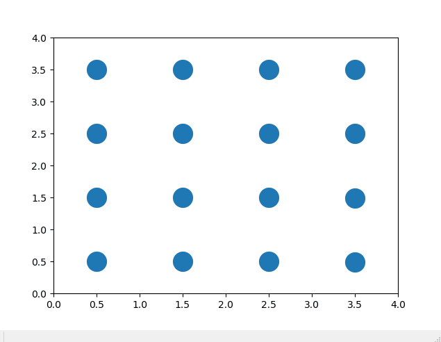
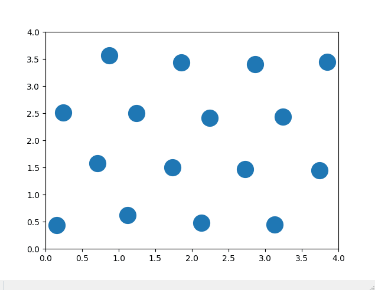
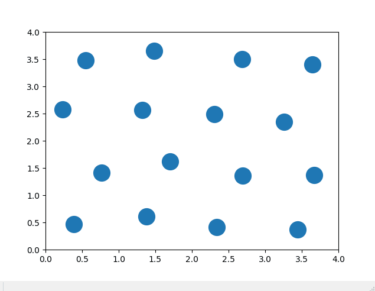

# particles-in-a-box
## Table of Contents
- [Introduction](#introduction)
- [Part 1 - Particles Start in Orderly Rows](#part-1---particles-start-in-orderly-rows)
- [Part 2 - Particles Start in Lattice](#part-2---particles-start-in-lattice)
- [Part 3 - Temperature of the System is Increased over Time](#part-3---temperature-of-the-system-is-increased-over-time)
- [Contact Me](#contact-me)

## Introduction
Analysis of Lennard-Jones particles in a 2D periodic box. For the problems being answered, look at the problems.pdf. For the in-depth analysis, look at the analysis.pdf.

## Part 1 - Particles Start in Orderly Rows

You can see the particles bounce around due to the forces from the Lennard-Jones potential.

## Part 2 - Particles Start in Lattice

Particles are given a small kick in velocity and the particles then settle into a new formation where the partcles appear to be the vertices of a rhombus. 

After running for 20 seconds the form can be seen below.(not real time, but in the simulation. This took minutes IRL to get to)

## Part 3 - Temperature of the System is Increased over Time

The above gif is at the start of the heating process. Slowly as temperature in increased the particles begin to move more.

The above gif shows that eventually, the particles loose structure due to the energy in the system. This is representative of the matter undergoing a phase change. Again, refer to the analysis.pdf in part 3 for more on this.

## Contact Me
Email: git@jakegeiser.us

